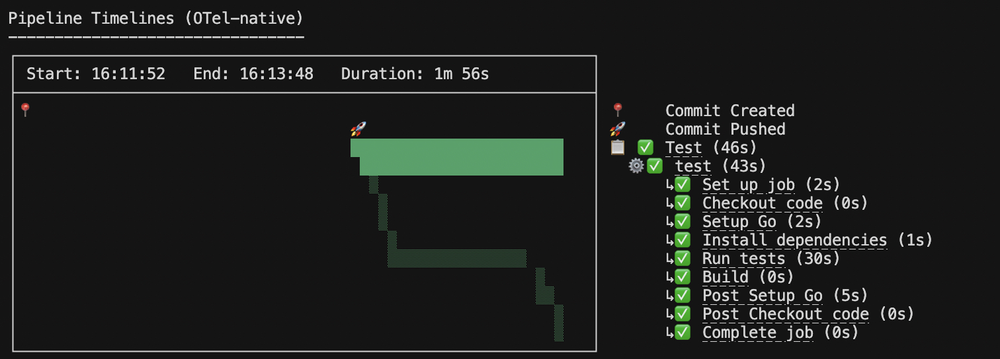
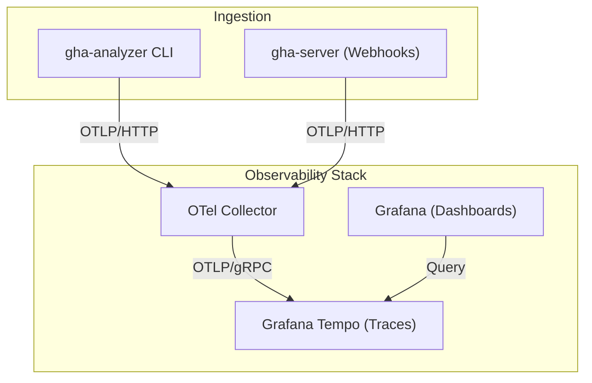

# GitHub Actions Analyzer

Analyze GitHub Actions performance and visualize workflow timelines in your terminal, [Perfetto UI](https://ui.perfetto.dev), or a full OpenTelemetry stack with Grafana.



## Installation

```bash
go install github.com/stefanpenner/gha-analyzer/cmd/gha-analyzer@latest
```

## Architecture



## Features

- **Terminal Waterfall**: Interactive timeline with clickable links.
- **Perfetto Integration**: Generate Chrome Tracing files for deep analysis.
- **OTel Stack**: Full observability with Grafana dashboards and Tempo tracing.
- **Webhook Server**: Real-time ingestion of GitHub Action events.
- **Smart Filtering**: Use `--window` to focus on recent activity.

## Usage

### CLI Quick Start

```bash
export GITHUB_TOKEN=your_token_here

# Analyze a PR or Commit
gha-analyzer nodejs/node/pull/60369

# Save trace for Perfetto visualization
gha-analyzer <url> --perfetto=trace.json
```

### Observability Stack (Grafana + Tempo)

The analyzer includes a pre-configured observability stack to visualize traces over time.

```bash
# 1. Start the stack (OTel Collector, Tempo, Grafana, and optional Runner)
# To include a self-hosted runner:
# REPO_URL=https://github.com/your/repo RUNNER_TOKEN=your_token ./run.sh up
./run.sh up

# 2. Run analysis (traces are automatically sent to the local collector)
./run.sh cli https://github.com/nodejs/node/pull/60369

# 3. Open the Grafana dashboard
./run.sh dashboard
```

## Custom GHA Runner

The stack includes a `runner` service that can act as a self-hosted GitHub Actions runner. This is useful for testing how your own runners report data.

To use it:
1. Generate a runner token in your GitHub repo/org settings.
2. Start the stack with the token:
   ```bash
   REPO_URL=https://github.com/your/repo RUNNER_TOKEN=your_token ./run.sh up
   ```

## Real-time Webhooks

You can subscribe to GitHub Webhooks to feed data into the collector in real-time.

### 1. Start the Webhook Server
```bash
./run.sh server
```
The server listens on port `8080` and exports traces to the OTel collector.

### 2. Configure GitHub Webhook
1. Go to your GitHub Repository/Org **Settings** -> **Webhooks**.
2. Add a new webhook:
   - **Payload URL**: `http://<your-ip-or-domain>:8080/webhook`
   - **Content type**: `application/json`
   - **Events**: Select `Workflow runs` and `Workflow jobs`.
3. (Optional) Use `smee.io` or `ngrok` to tunnel local port `8080` to the internet for testing.

## Flags

- `--perfetto=file.json`: Save trace for Perfetto.dev analysis.
- `--window=duration`: Only show events within duration of merge/latest activity (e.g., `24h`, `2h`).
- `--open-in-perfetto`: Automatically open the trace in Perfetto UI.
- `--open-in-otel`: Automatically open the OTel Desktop Viewer.

## License

MIT
